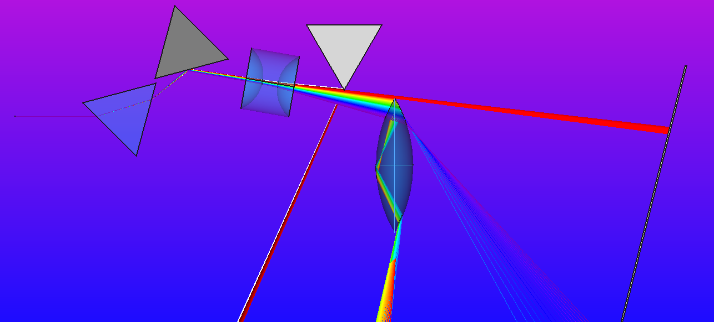

Check out OpticsExample.FCStd. You will need to get the "Optics" workbench in FreeCAD to run this. You can do this in FreeCAD by going to Tools -> AddonManager -> 
Search for and install Optics Workbench.

Would be cool to see some telescopes designed with this!

