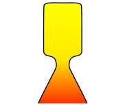

# SpacecraftDesigner
Design your very own spacecraft using FreeCAD.

Spacecraft Designer is meant to create spacecraft for the Explorers repository.
https://github.com/VallesMarinerisExplorer/Explorers/tree/main

Here is a link to the documentation:
https://docs.google.com/document/d/17-0f0Di_PyV1-UBev-qz00vglF6IMoDuzYaq7braegs/edit?usp=sharing
